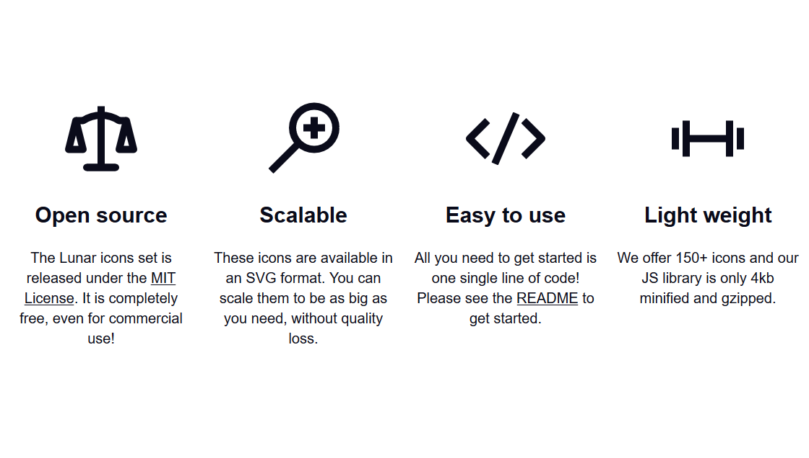

# Lunar Icons

<p align="center">
    
</p>

<p align="center">
    <a href="https://github.com/lucasgruwez/lunar-icons/releases">
        
    </a>
    <a href="https://github.com/lucasgruwez/lunar-icons/releases">
        
    </a>
    <a href="LICENSE">
        
    </a>
    <a href="">
        
    </a>
    <a href="https://travis-ci.org/lucasgruwez/lunar-icons">
        
    </a>
    <a href="http://gulpjs.com/">
        
    </a>
</p>

A set of beautiful handcrafted SVG icons.



## Getting Started

Lunar Icons is a set of SVG icons that can be used in your html page. You can download them from this repo, and use them either inline, inside an `` tag, or any other way you would use SVG files.

To make the process of using these icons a bit easier, we wrote some JS that will automatically replace them for you.

#### Get script

You can either download `lunar-icons.js` or `lunar-icons.min.js` from the `./dist/` folder in this repository, or you can include them via a CDN.

```html
<script src="../path/to/lunar-icons.wc.min.js"></script>
<!-- Or if you decide to use a CDN -->
<script src="https://unpkg.com/lunar-icons/dist/lunar-icons.wc.min.js"></script>
```

#### Use icon

Lunar Icons is built using custom web components since v2.0.0. To add an icon to your site, use the following code, replacing `icon="sheild"` with whatever icon you would like to use.

```html
<lunar-icons icon="sheild"></lunar-icons>
```

## Like this project?

Please feel free to give the lunar-icons repo a star, and if you want to help support my work, please consider [donating](https://paypal.me/lucasgruwez).

## Versioning

We use [SemVer](http://semver.org/) for versioning. For the versions available, see the [tags on this repository](https://github.com/lucasgruwez/waffle-grid/tags).

## Authors

- **Lucas Gruwez** - *Author* - [@lucasgruwez](https://github.com/lucasgruwez)

See also the list of [contributors](https://github.com/lucasgruwez/waffle-grid/contributors) who participated in this project.

## License

This project is licensed under the MIT License - see the [LICENSE](LICENSE) file for details

Copyright &copy; 2018 @lucasgruwez All Rights Reserved.
